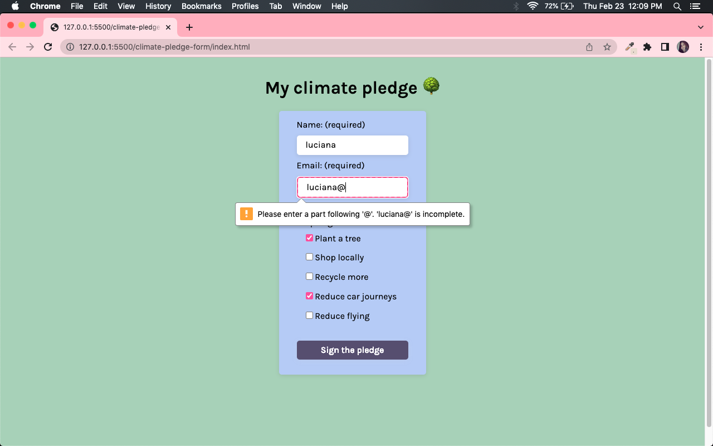
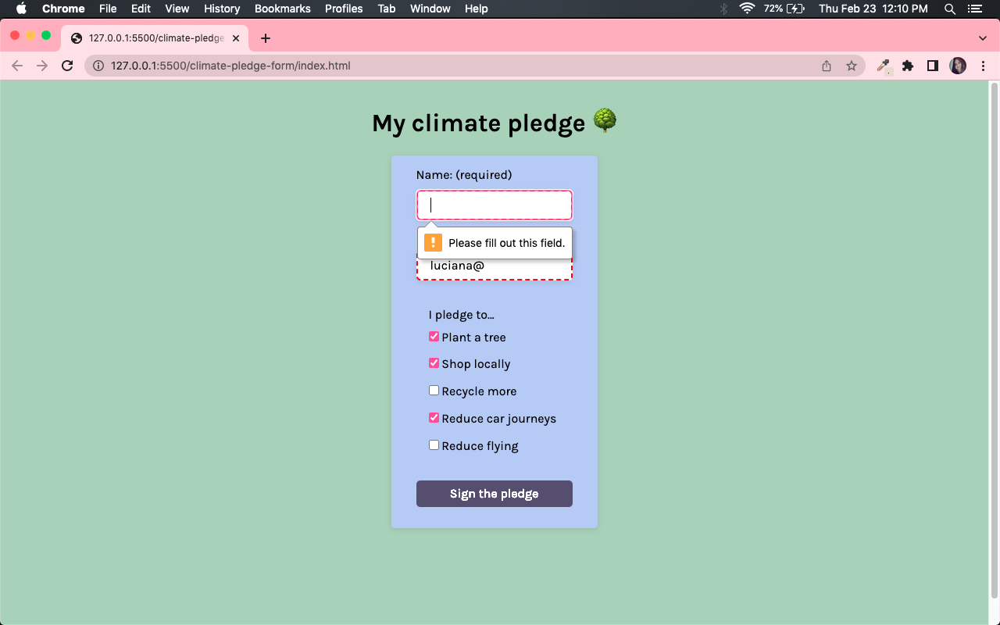

# Scrimba Challenge Weeks

This repository contains JavaScript coded solutions to Scrimba's Challenge Week. The aim is to complete the challenges and the stretch goals while training my coding skills. Scrimba is a code learning platform.

## 1. Climate Pledge Form
task: 
• Add validation to check that the name and email fields are filled in and display a warning message if not.
• Hide the form and show a thank you message on submit. 

<picture>
  
  
</picture>

